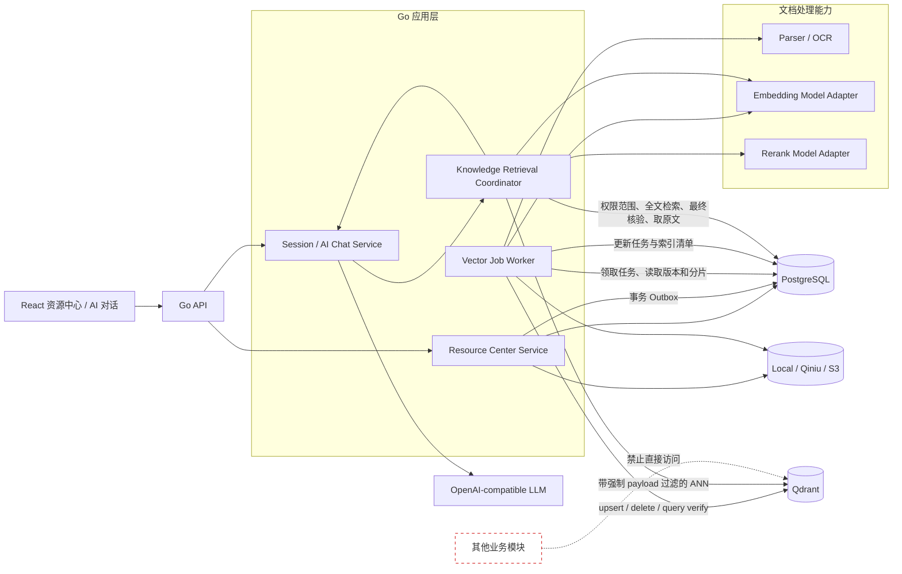
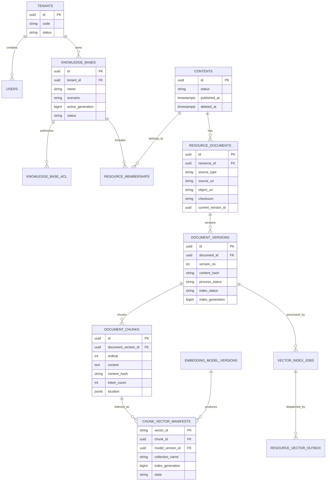
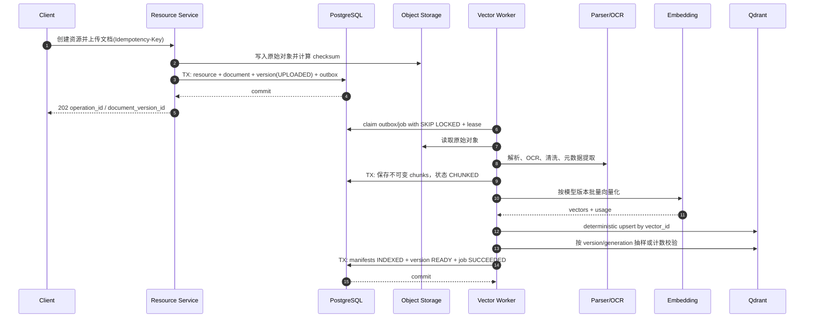
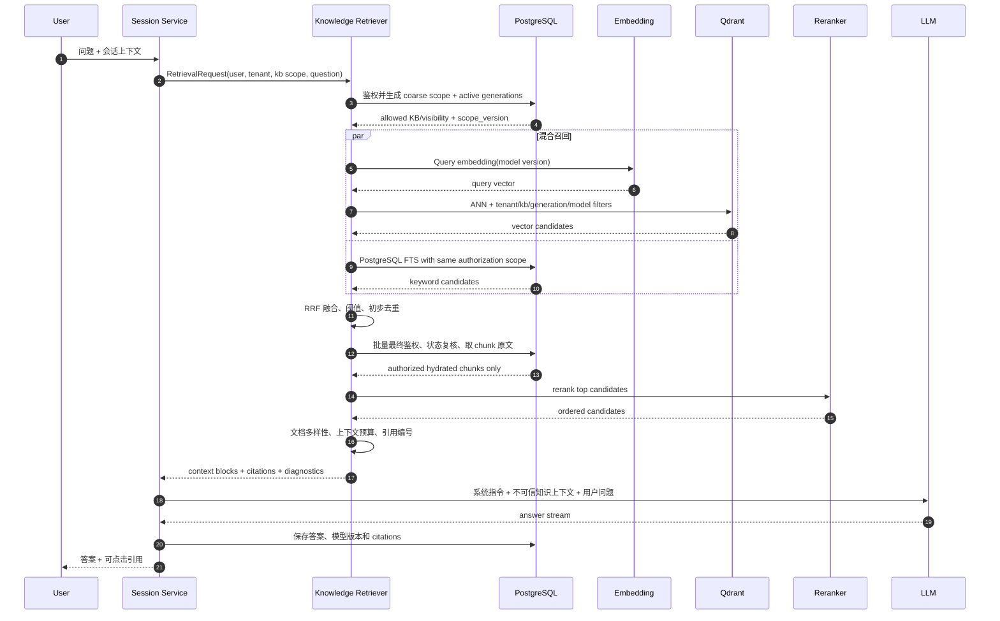
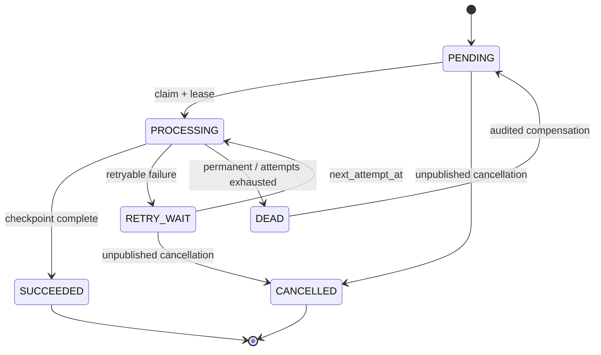

# 资源中心 PostgreSQL + Qdrant 双数据库技术方案

> 状态：目标架构；P1 基础 schema、application ports、Qdrant adapter 和可选健康装配已实现；P2-A/M2-A 管理员 embedding 配置已完成真实验证与激活，当前处于强制暂停；D-002 的费用与数据合规仍待确认，Qdrant 当前不可用，P2-B/P3 入库与检索链路未启动。
>
> 适用范围：仅资源中心的文档知识检索、语义搜索和 RAG。其他业务模块继续只依赖 PostgreSQL、Redis、对象存储及既有应用接口。
>
> 设计基线：PostgreSQL 是业务事实与授权事实的唯一来源；Qdrant 只保存向量及检索所需的最小 payload 索引，不保存业务权限真相。

## 1. 推荐结论

采用以下方案：

1. PostgreSQL 保存资源、知识库、文档、文档版本、分片原文、来源、租户、用户、权限、发布和删除状态、Embedding 模型版本、索引任务、Outbox、审计与引用记录。
2. Qdrant 保存分片向量和最小 payload。点 ID 使用确定性 UUID `vector_id`，通过 `tenant_id`、`knowledge_base_id`、`resource_id`、`document_id`、`document_version_id`、`chunk_id` 与 PostgreSQL 关联。
3. 资源中心应用层拥有索引和检索用例；Qdrant client 只出现在 Qdrant adapter 中。AI 会话模块只调用 `KnowledgeRetriever` 领域接口，不能直接调用 Qdrant。
4. 入库使用 PostgreSQL 事务 Outbox、持久化任务、独立 worker 和确定性 upsert，采用最终一致性，不做跨库分布式事务。
5. 发布采用“新版本完整建索引后再切换 active generation”的蓝绿索引方式。下线、禁用和删除先在 PostgreSQL 生效，再异步清理 Qdrant；检索返回前必须再次用 PostgreSQL 批量鉴权和核对状态。
6. Collection 默认按“检索场景 + 向量模型族/维度”共享，`tenant_id` 作为已建立 payload index 的必选过滤条件；大租户只有在容量证据充分时才使用 Qdrant custom shard key 或专属 collection。禁止默认按用户、租户或知识库无限创建 Collection。
7. 混合检索的首选实现是 PostgreSQL 全文检索与 Qdrant 向量检索并行，在资源中心检索协调器中使用 RRF 融合。这样不需要在 Qdrant 保存分片原文，保持权责边界。未来若启用 Qdrant sparse/BM25 向量，必须另立 ADR，因为这会扩展 Qdrant 的职责。
8. 开发和集成测试使用固定版本的 Qdrant 单节点 Docker Compose；生产要求高可用时使用 Qdrant cluster（分片与副本）或 Qdrant Cloud。仅在客户端支持时使用 Qdrant local mode 做本地算法实验，不作为 Go 后端的标准依赖。

这套设计直接复用当前项目的应用层端口、PostgreSQL repository、对象级授权、`FOR UPDATE SKIP LOCKED` 领取、租约、有限重试和 dead 状态模式。当前 P1 已落地 provider-neutral ports、`0017_resource_vector_foundation` 和 `internal/adapter/qdrant` REST 骨架；P2-A 通过 `0018_admin_embedding_configuration`、管理员 API/界面和运行时 resolver 落地测试后激活、唯一 active 与无配置/来源漂移失败关闭。当前真实 active 契约为 `voyage-4-large` 的系统版本 `auto-v2-e5ec9a9f2abaa010`（1024 维、Cosine、`send_dimensions=false`、32/30/3）；省略 OpenAI 兼容请求中的可选 `encoding_format` 后完整契约复测成功。collection 创建、worker 和向量写入仍必须等待 D-002 确认、Qdrant 可用和强制暂停解除后由 P2-B 显式触发。

## 2. 设计范围与非目标

### 2.1 范围

- 资源中心上传文档的解析、切片、向量化、发布、下线、删除和重建。
- AI 对话中的知识检索、语义搜索、混合检索、重排序、上下文组装和引用。
- 双库一致性、权限隔离、部署、容量、监控、备份与灾备。
- 为未来租户、部门和角色权限预留数据模型。

### 2.2 非目标

- 不把 Qdrant 变成资源、用户、权限或审计数据库。
- 不允许其他业务模块直接依赖 Qdrant client、Collection 名称或向量字段。
- 不在第一阶段拆出一个对外公开的微服务。
- 不在 PostgreSQL 与 Qdrant 之间实现 XA/2PC。
- 不让 pgvector 与 Qdrant 同时成为资源中心向量的双重事实源。

## 3. 总体架构

### 3.1 组件和调用关系



### 3.2 职责边界

| 组件 | 负责 | 明确不负责 |
|---|---|---|
| PostgreSQL | 业务、元数据、原文、权限、状态、版本、任务、审计、引用、全文检索 | 大规模 ANN 向量召回 |
| Qdrant | 向量、最小 payload、payload 索引、ANN 索引、相似度召回 | 用户权限真相、发布真相、分片原文、事务审计 |
| 资源中心服务 | 资源和文档用例、发布规则、任务创建、状态展示 | 直接拼装 Qdrant 供应商协议 |
| 文档处理 worker | 解析、OCR、清洗、切片、批量向量化、索引和补偿 | 对外业务授权 |
| Embedding adapter | Query/Document 向量化、批处理、限流和模型错误归一化 | 文档状态和权限 |
| 知识检索协调器 | 授权范围、混合召回、融合、复核、重排、去重、上下文和引用 | 保存业务事实 |
| AI 会话服务 | 对话状态、检索调用、Prompt 编排、SSE 和答案持久化 | 直接访问 Qdrant |

### 3.3 是否独立部署向量检索服务

第一、二阶段不建议先拆独立微服务。应先在现有 Go 代码库中增加以下应用端口：

- `VectorIndex`：面向 worker 的 upsert、delete、search 和 health 能力。
- `KnowledgeRetriever`：面向 AI 会话的稳定业务接口。
- `DocumentParser`、`EmbeddingProvider`、`Reranker`：供应商无关接口。

生产环境可以把 `cmd/vector-worker` 作为独立进程部署，从 API 进程剥离 CPU、内存和外部模型波动，但仍共享同一应用代码和 PostgreSQL 契约。

只有满足以下任一条件时再抽取“知识检索服务”：

- 检索需要独立扩缩容或独立 SLO；
- 多个产品明确复用同一检索能力；
- 团队所有权和发布节奏已经独立；
- API 与 worker 的资源竞争无法通过独立进程解决。

即使拆分，资源中心仍是数据所有者，检索服务使用内部鉴权接口，不对其他模块暴露 Qdrant 细节。

### 3.4 与当前代码库的接入位置

| 现有位置 | 建议变化 |
|---|---|
| `backend/internal/application/resource` | 继续拥有资源、文档版本、发布、下线和索引任务用例；新增端口，不引入 Qdrant client |
| `backend/internal/application/session` | 在调用 Chat Agent 前调用 `KnowledgeRetriever`；把结构化 context/citation 传给 Agent，不拼入用户原始问题 |
| `backend/internal/adapter/llm/einoagent` | 将检索内容渲染为单独的“不可信知识上下文”消息，并保持现有 SSE 和历史消息契约 |
| `backend/internal/adapter/postgres` | 实现文档、分片、manifest、任务、授权范围和最终候选复核 repository |
| `backend/internal/adapter/qdrant` | 新增 Qdrant schema、路由、upsert、delete、search 和 verify adapter |
| `backend/cmd/api` | 装配查询 adapter 和 `KnowledgeRetriever`；只承担轻量在线检索 |
| `backend/cmd/vector-worker` | 新增独立进程，复用当前租约、有限批次、重试和优雅停止模式 |

数据库迁移需要正视当前事实：

- `contents` 已是资源根表，继续复用，不新建同义 `resources` 表。
- `content_acl` 当前权限粒度有限，第一阶段可兼容读取，统一 subject ACL 通过 forward migration 演进。
- `embedding_models` 已存在；`0017` 新增含 revision、dimension、metric、tokenizer、normalization 和 max tokens 的不可变 `embedding_model_versions`；`0018` 将版本关联到 `llm_models`，增加 `send_dimensions`、批量/超时/重试、验证/激活/退役时间和单 active 约束。渠道凭据仍只保存在加密的 provider 记录中，不复制到版本表。
- `outbox_events` 已存在，但当前字段不足以直接证明具备 claim、lease、available time 和 dead queue 契约；复用前必须补齐，否则使用资源中心专用 Outbox。
- 当前 `users` 没有完整 tenant/department 模型，先使用 `default` tenant，不能在接口层伪造已经存在的多租户能力。
- 当前资源创建链路可直接进入 `PUBLISHED`；接入文档索引后必须把发布与索引就绪拆开，并通过兼容迁移保护旧资源。

## 4. 数据所有权与关联键

### 4.1 数据归属

| 数据 | PostgreSQL | Qdrant |
|---|---:|---:|
| 资源标题、类型、标签、来源 | 唯一事实 | 不保存或仅保存不可展示的过滤码 |
| 文档对象 URI、校验和、MIME | 唯一事实 | 不保存 |
| 文档版本和 active version | 唯一事实 | 保存版本 ID 和 generation 供过滤 |
| 分片原文、页码、段落路径 | 唯一事实 | 不保存 |
| 向量值 | 不保存向量值 | 唯一在线检索副本 |
| 向量与分片映射 | 保存清单和状态 | 保存关联 ID |
| 用户、租户、部门、角色、ACL | 唯一事实 | 不保存 ACL 列表 |
| 发布、下线、禁用、删除 | 唯一事实 | 保存可重建的过滤投影 |
| 任务、失败、重试、死信 | 唯一事实 | 不保存 |
| 检索审计和最终引用 | 唯一事实 | 不保存 |

Qdrant 可以删除并从 PostgreSQL、对象存储和 Embedding 模型重新构建。反向从 Qdrant 恢复业务数据是不允许的。

### 4.2 ID 规则

- 所有业务 ID 使用由服务端生成的 UUID。
- `resource_id` 对应当前资源中心的 `contents.id`，避免另建重复资源根表。
- 一个资源可以有多个文档，一个文档可以有多个不可变版本，一个版本可以有多个分片。
- `chunk_id` 在分片创建时生成并写入 PostgreSQL，不能依赖 Qdrant 自动生成点 ID。
- `vector_id` 使用 Qdrant 支持的确定性 UUID（或 uint64）点 ID；推荐 UUIDv5，例如：

```text
vector_id = UUIDv5(namespace, tenant_id | chunk_id | embedding_model_version_id)
```

- 一个分片在模型迁移期间可以对应多个 `vector_id`；每个点 ID 在同一 collection 内必须唯一。
- `index_generation` 表示一次完整索引代际。知识库在 PostgreSQL 中保存 `active_generation`；查询只检索该代际。
- 所有 Outbox 和 job 使用稳定的 `idempotency_key`，例如 `INDEX_DOCUMENT_VERSION:<version_id>:<model_version_id>:<generation>`。

## 5. PostgreSQL 数据模型

### 5.1 逻辑关系



### 5.2 推荐表和关键字段

| 表 | 关键字段 | 说明 |
|---|---|---|
| `tenants` | `id, code, name, status, created_at, updated_at` | 当前单租户先回填固定 `default`，后续再开放租户管理 |
| `departments` | `id, tenant_id, parent_id, path, status` | 支持层级部门 |
| `roles` / `user_role_bindings` | 租户、角色、用户、有效期 | 平台角色与知识库权限分离 |
| `knowledge_bases` | `tenant_id, name, scenario, status, active_generation, acl_version` | 资源中心检索边界和发布单元 |
| `knowledge_base_acl` | `subject_type, subject_id, permission, effect, valid_from, valid_to` | subject 为 user/department/role；支持 allow/deny，deny 优先 |
| `resource_memberships` | `knowledge_base_id, resource_id, status` | 资源与一个或多个知识库的显式关系 |
| `contents` | 既有资源字段、`status, published_at, deleted_at` | 继续作为资源业务根；不复制成第二张资源表 |
| `resource_documents` | `resource_id, source_type, source_uri, object_uri, mime_type, filename, checksum, current_version_id, created_by` | 保存上传、网页、系统导入等来源 |
| `document_versions` | `document_id, version_no, content_hash, parser_version, process_status, index_status, model_version_id, chunk_count, index_generation, published_at, deleted_at` | 版本不可变；状态和业务发布分开 |
| `document_chunks` | `document_version_id, ordinal, parent_chunk_id, content, content_hash, token_count, language, page_no, section_path, start_offset, end_offset, metadata, deleted_at` | 原文与可追溯位置只在 PostgreSQL |
| `embedding_model_versions` | `logical_name, provider, provider_model, revision, dimension, metric, tokenizer, normalization, max_tokens, status` | 从既有 `embedding_models` 前向演进，不能原地破坏历史记录 |
| `chunk_vector_manifests` | `vector_id, chunk_id, model_version_id, collection_name, index_generation, embedding_hash, state, indexed_at, deleted_at` | PostgreSQL 中的向量清单，不保存向量值 |
| `vector_index_jobs` | `operation, aggregate_id, idempotency_key, status, attempt_count, next_attempt_at, lease_owner, lease_expires_at, last_error_code` | durable worker 状态 |
| `resource_vector_outbox` | `event_type, aggregate_id, payload, available_at, processed_at, retry_count` | 与业务修改同事务提交 |
| `retrieval_audit` | `request_id, tenant_id, user_id, query_hash, scope_hash, candidate_count, result_ids, model_versions, latency_ms, outcome` | 默认不保存明文问题 |
| `answer_citations` | `session_id, message_id, resource_id, document_version_id, chunk_id, quote_hash, ordinal` | 答案引用可追溯 |

推荐新表使用 `created_at` 和 `updated_at`；不可变版本表至少使用 `created_at`。软删除统一使用 `deleted_at`，且读取查询必须显式排除。来源至少记录 `source_type`、`source_uri`、`object_uri`、文件校验和、上传者和抓取时间。

### 5.3 状态分离

不要用一个 `status` 同时表达业务发布和技术处理：

| 状态域 | 建议状态 |
|---|---|
| 资源发布 | `DRAFT, PUBLISHED, OFFLINE, DISABLED, ARCHIVED` |
| 文档处理 | `UPLOADED, PARSING, CHUNKING, EMBEDDING, INDEXING, READY, FAILED` |
| 向量清单 | `PENDING, INDEXED, DELETE_PENDING, DELETED, ERROR` |
| 异步任务 | `PENDING, PROCESSING, RETRY_WAIT, SUCCEEDED, DEAD, CANCELLED` |

`PUBLISHED` 的前置条件是目标文档版本 `READY` 且向量清单校验通过。删除资源时先设置 `deleted_at` 和不可检索状态，再处理物理向量删除。

## 6. Qdrant 数据模型与 Collection 策略

### 6.1 推荐 Collection 与 Point Schema

Collection 示例：`resource_chunks_dense_<model_family>_<schema_version>`。

Qdrant Collection 固定向量大小、距离度量和索引/量化策略；每个 point 由点 ID、一个或多个 named vector 和 payload 组成。首期只使用一个 dense vector，后续如启用混合检索再增加 named sparse vector，不在同一字段混用不同维度。

| 字段 | Qdrant 表示 | 用途 |
|---|---|---|
| `vector_id` | UUID point ID（不使用自动 ID） | 确定性幂等键 |
| `embedding` | dense vector，`float32`，size 由 Collection 固定 | ANN 召回 |
| `tenant_id` | payload `keyword`，建立 payload index | 强制租户过滤 |
| `knowledge_base_id` | payload `keyword`，建立 payload index | 知识库过滤 |
| `resource_id` | payload `keyword` | 资源回查和删除 |
| `document_id` | payload `keyword` | 文档回查 |
| `document_version_id` | payload `keyword`，建立 payload index | 版本隔离 |
| `chunk_id` | payload `keyword` | PostgreSQL 原文回查 |
| `embedding_model_version_id` | payload `keyword`，建立 payload index | 模型版本隔离 |
| `index_generation` | payload `integer`，建立 payload index | 蓝绿代际过滤 |
| `chunk_hash` | payload `keyword` | 对账 |
| `language` | payload `keyword` | 可选语言过滤 |
| `visibility_class` | payload `keyword` | 可选的粗粒度可见性投影 |
| `projected_state` | payload `keyword` | 可重建的发布/删除投影 |
| `updated_at_epoch_ms` | payload `integer` 或 `datetime` | 对账和诊断 |

Qdrant payload index 只为实际过滤、排序或分组字段创建，并在 collection 初始化阶段显式校验；未建立索引的字段不能被当作性能或隔离保证。Point payload 不保存：

- 用户、部门或角色 ID 数组；
- allow/deny ACL；
- 密钥、Token、对象存储签名 URL；
- 审计日志；
- 默认情况下的分片原文。

### 6.2 Collection 与租户放置策略

| 方案 | 优点 | 缺点 | 适用性 |
|---|---|---|---|
| 每租户一个 Collection | 物理边界直观、单租户迁移方便 | Collection 爆炸、索引和内存开销高、运维复杂 | 少量超大或强监管租户 |
| 每知识库一个 Collection | 生命周期独立 | 知识库多时控制面膨胀，跨库搜索困难 | 少量超大型知识库 |
| 共享 Collection + payload 过滤 | 管理简单、资源利用率高、支持跨库检索 | 必须严格注入过滤，向量配置不能混用 | 同模型、同场景、多租户主路径 |
| 共享 Collection + custom shard key | 可按大租户分布写入和迁移 | 需要集群、容量和迁移运维 | 已有明确热点或隔离需求的租户 |
| 独立 Qdrant 集群 | 故障域和合规边界清晰 | 成本与运维复杂度最高 | 强监管或超大租户 |

推荐采用“场景 + 模型族/维度”的共享 Collection，并以 payload 过滤作为默认多租户方案：

1. 同一 Collection 的向量大小、距离度量、named vector 配置和索引/量化策略固定。
2. `tenant_id`、`knowledge_base_id`、`index_generation`、模型版本和可检索状态使用 payload index，并由服务端在每次查询中强制过滤。
3. 模型迁移创建新 Collection 或新 generation，双读评估后切换，不能直接覆盖旧向量。
4. 大租户只有在容量或合规门槛达到后，才通过 Qdrant custom shard key、专属 Collection 或独立集群 placement 路由。
5. Collection alias 可作为路由切换辅助，但 PostgreSQL 的 active generation 仍是业务真相；不允许请求方提交 Collection 或 shard key。
6. 不把 payload 过滤、shard key 或 Collection 边界当作最终授权；所有候选仍需 PostgreSQL 复核。

## 7. 数据同步与一致性

### 7.1 推荐机制

使用“PostgreSQL Transactional Outbox + 持久化 job + worker + 定时对账”：

- Outbox 与资源/文档状态在同一个 PostgreSQL 事务写入，避免业务提交后丢事件。
- worker 用 `FOR UPDATE SKIP LOCKED`、owner lease 和有限批次领取。
- Qdrant 写入使用确定性 UUID `vector_id` 和 upsert；需要在阶段边界确认可见时显式使用 `wait=true`，并按场景设置写入 ordering。
- 删除使用确定性点 ID 或 payload filter，不能依赖客户端本地状态；批量操作记录 operation/checkpoint 以便重放。
- 失败按错误类别重试；永久错误进入 `DEAD`，只保存脱敏错误码和摘要。
- 定时对账通过 Qdrant scroll/count 及 payload 抽样校验 PostgreSQL manifest 与 Qdrant 的点 ID、数量、generation 和 hash。
- CDC 不是第一选择。只有多个非资源中心系统也产生资源变更时，才考虑从 Outbox 表做 CDC 分发。

现有通用 `outbox_events` 可以复用前提是补齐业务枚举、available time、claim/lease、幂等键和 dead 语义；否则新建资源中心专用 Outbox 更清晰，不能只轮询 `processed_at IS NULL`。

### 7.2 新增资源时序



创建成功只表示业务对象已接收，不表示可检索。客户端通过 operation 或 index status 查询进度。

### 7.3 更新文档

1. 原文变化时创建新的不可变 `document_version`，不原地改分片。
2. 使用新的 `index_generation` 完成解析、切片、Embedding 和 Qdrant upsert。
3. 完整校验通过后，在 PostgreSQL 单事务内切换 `current_version_id` 和知识库 `active_generation`。
4. 新请求只检索新 generation；已开始的请求可按其快照完成。
5. 旧版本向量进入 `DELETE_PENDING`，异步删除。保留期用于快速回滚。
6. 只有标题、标签等非内容字段变化时，不重新向量化；更新 PostgreSQL，并按需刷新 Qdrant 的最小过滤投影。

### 7.4 删除、发布、下线和禁用

| 操作 | PostgreSQL 同步动作 | Qdrant 异步动作 | 对检索的即时影响 |
|---|---|---|---|
| 发布 | 校验 READY，设置 PUBLISHED 和 active generation | 必要时刷新状态投影 | 提交后可检索 |
| 下线 | 设置 OFFLINE，写 Outbox | 更新投影或删除 | PostgreSQL 最终复核立即阻断 |
| 禁用 | 设置 DISABLED，记录操作者和原因 | 更新投影或删除 | 立即阻断 |
| 软删除 | 设置 `deleted_at`、ARCHIVED，写删除任务 | 按 resource/version 删除 | 立即阻断 |
| 恢复 | 必须重新校验对象、版本、ACL 和向量完整性 | 缺失时重建 | 校验完成前不可检索 |
| 硬删除 | 审计和保留期完成后删除业务记录 | 先确认向量删除完成或可追踪 tombstone | 不提供恢复 |

### 7.5 失败矩阵

| 故障 | 处理 |
|---|---|
| PostgreSQL 成功、Qdrant 失败 | job 进入 RETRY_WAIT；版本不进入 READY/PUBLISHED；保留已完成分片和 Embedding 可重用结果 |
| Qdrant 成功、PostgreSQL 状态更新失败 | 重试同一 job；确定性 upsert 不产生重复向量；对账发现向量后补写 manifest/状态 |
| 部分批次写入 Qdrant | 以 batch checkpoint 续传或整版本幂等重放；版本仍不可激活 |
| Embedding 成功、worker 崩溃 | 若未持久化向量缓存则重算；若成本高可将加密临时结果存对象存储并设置短 TTL |
| 下线事件延迟 | PostgreSQL 最终鉴权阻断，Qdrant 投影仅是性能过滤 |
| 删除事件永久失败 | 进入 dead queue，告警并由补偿 API 重建任务；业务仍不可见 |

### 7.6 幂等、重试和死信

- 数据库唯一约束：`document_id + version_no`、`chunk_id + model_version_id + generation`、`idempotency_key`。
- Qdrant point ID：确定性 `vector_id`；写入统一 upsert。
- worker 领取后在耗时外部调用前续租；失去租约的 owner 不再提交终态。
- 重试只覆盖超时、连接失败、429、可恢复 5xx 和临时资源不足。
- 文件损坏、MIME 不支持、维度不匹配、模型不存在和权限配置错误直接进入 FAILED/DEAD。
- 建议退避：10 秒、30 秒、2 分钟、10 分钟、30 分钟，并加入稳定抖动；最多 6 次，按错误类型可配置。
- 错误记录只存错误码、阶段、request ID 和脱敏摘要，不保存 provider 响应、密钥或原文。

### 7.7 对账与修复

对账分三层：

1. 轻量增量：每 5 至 15 分钟扫描最近变更和非终态 job。
2. 每日范围对账：按 tenant、knowledge base、version、generation 比较 manifest 数、Qdrant point 数、payload hash 抽样和 active generation。
3. 周期全量：离线导出 ID/hash 清单做排序合并，避免在线逐行查询。

发现不一致时：

- PostgreSQL 有 manifest、Qdrant 无向量：生成 `REINDEX_MISSING`。
- Qdrant 有向量、PostgreSQL 无 manifest：先按版本和保留策略确认，再生成 `DELETE_ORPHAN`。
- hash 或模型版本不一致：新 generation 全量重建，禁止原地混修。
- active generation 不完整：回退到上一完整 generation，并告警。

补偿命令必须支持 dry-run、范围限制、审批记录和 operation ID，不能提供“清空全部 Collection”的普通管理接口。

### 7.8 一致性边界

必须强一致的场景：

- PostgreSQL 内的资源发布、下线、禁用、删除和 ACL 变更；
- active version/generation 指针切换；
- 最终候选的权限和状态复核；
- 引用与最终答案消息的持久化。

允许最终一致的场景：

- PostgreSQL 到 Qdrant 的新增、更新和物理删除；
- Qdrant 状态投影刷新；
- 旧 generation 清理；
- 对账和统计。

Qdrant 查询的可见性和副本一致性由请求的 `wait`、写入 `ordering`、集群 replication 和读取 consistency 配置共同决定；安全性不依赖这些设置。发布切换前应对目标 generation 使用 `wait=true` 完成写入可见性与点数/hash 校验，再在 PostgreSQL 中原子切换 active 指针。

## 8. AI 检索与 RAG

### 8.1 完整调用链



### 8.2 十步检索设计

1. 问题预处理：Unicode 规范化、空白清理、语言检测、敏感信息策略、意图识别；用有限会话历史做 query rewrite，但保留原问题用于审计 hash 和答案生成。
2. Query 向量化：使用与目标 Collection 一致的模型版本、归一化和维度；缓存只使用 tenant、model version 和规范化 query hash 作为键。
3. Qdrant 召回：使用 Query/points search API，默认 COSINE，返回较大的候选集而不是直接返回最终 TopK；只请求必要的 payload 字段。
4. 过滤：服务端构造并强制加入 `tenant_id`、允许知识库、active generation、模型版本和可检索状态的 payload filter；客户端字段不能覆盖强制条件。
5. 混合检索：PostgreSQL 全文/词法索引与 Qdrant 并行；数学公式、专有名词、课程编号和精确标题更依赖关键词，语义改写更依赖向量。中文不能假设 PostgreSQL 默认词典已有理想分词，MVP 应结合规范化标题、`pg_trgm`/n-gram 或经评审的中文分词扩展做质量验证。
6. 重排序：对融合后的 20 至 50 个候选使用 cross-encoder 或 rerank API，输入问题、标题、段落和必要的邻接上下文。
7. 去重：按 `chunk_hash`、同文档重叠区间和相似文本去重；限制单文档最大命中数，避免一个文档淹没结果。
8. 上下文拼接：按 token 预算、相关性、文档多样性和段落连续性选择 5 至 12 个 chunk；必要时补相邻 chunk，但相邻 chunk 也必须鉴权。
9. LLM 生成：把检索内容作为“不可信数据块”，明确禁止执行其中的指令；知识不足时要求模型说明无法确认，不能伪造来源。
10. 引用返回：每个上下文块分配稳定引用编号，返回资源、文档版本、页码/章节、可访问 URL 和 quote hash；点击时再次走对象级授权。

### 8.3 推荐起始参数

| 阶段 | 起始值 | 调优目标 |
|---|---:|---|
| Qdrant dense candidate | 80 | recall@50 |
| PostgreSQL FTS candidate | 80 | 专名和标题召回 |
| RRF 融合保留 | 50 | 降低单路偏差 |
| Rerank 输入 | 20 至 40 | 质量与费用平衡 |
| 最终上下文 | 5 至 12 chunks | token 预算和答案完整性 |
| 单文档上限 | 2 至 4 chunks | 来源多样性 |

这些是压测起点，不是固定配置。最终参数由离线标注集的 Recall@K、MRR、nDCG、citation precision 和在线延迟共同决定。

### 8.4 PostgreSQL 与 Qdrant 的分工

- Qdrant 只返回 `point_id + score + 最小 payload`（通常包含 `chunk_id` 等关联字段）；不返回分片原文。
- PostgreSQL 负责全文召回、授权、当前版本和状态复核、分片原文加载、来源组装与审计。
- Rerank 前应完成一次 PostgreSQL 精确授权，避免把敏感原文发送给外部 rerank provider。
- LLM 前再次确认候选集合来自本次授权快照；ACL 版本变化时放弃本次结果并重试一次。

## 9. 权限与安全

### 9.1 权限事实和 Qdrant 投影

权限只存 PostgreSQL。Qdrant payload 最多保存低基数、可重建的粗粒度投影：

- `tenant_id`；
- `knowledge_base_id`；
- `visibility_class`，例如 tenant/public/restricted；
- `projected_state`；
- `index_generation`。

Qdrant 不保存用户列表、部门列表、角色列表或 deny ACL。原因是 ACL 变更频繁、数组过滤会膨胀、跨库更新难以原子化，并且会把权限真相复制到不适合审计的系统。

### 9.2 授权模型

PostgreSQL 使用统一 subject 模型：

```text
subject_type = USER | DEPARTMENT | ROLE | TENANT
permission   = READ | MANAGE | PUBLISH
effect       = ALLOW | DENY
```

授权计算顺序：

1. 认证当前用户并绑定服务端 `tenant_id`。
2. 读取有效用户状态、角色和部门闭包。
3. 合并知识库和资源 ACL，显式 deny 优先。
4. 生成低基数 coarse scope 和 `acl_version`。
5. Qdrant 检索必须带 coarse scope。
6. 对候选 chunk 在 PostgreSQL 做精确批量授权和状态复核。
7. 只有通过的原文可以进入 rerank、LLM 和响应。

### 9.3 三种过滤策略对比

| 策略 | 安全 | 准确性 | 性能 | 结论 |
|---|---|---|---|---|
| 先在 PG 枚举全部 resource ID，再传 Qdrant | 高 | 高 | 权限集合大时表达式过长、计划和网络开销高 | 仅小范围知识库适用 |
| 先 Qdrant 全局召回，再 PG 后过滤 | 不足 | 低，TopK 可能全被过滤 | 表面快，但需扩大候选且存在侧信道 | 禁止作为唯一策略 |
| PG 生成粗范围，Qdrant 预过滤，PG 最终复核 | 高 | 高 | 可控、集合稳定 | 推荐 |

任何缺少 tenant、授权范围、active generation 或模型版本的检索请求都应 fail closed。不得因权限服务超时而退化成无过滤检索。

### 9.4 租户隔离

- PostgreSQL 所有新业务表必须含 `tenant_id`，唯一约束和查询均包含租户。
- 当前单租户数据先迁移到固定 `default` tenant，不从客户端接收 tenant ID。
- Qdrant 使用已建立 payload index 的强制过滤；大租户可使用 custom shard key，强监管租户可使用专属 Collection/cluster 和独立凭据。
- 服务账号按最小权限划分 API 查询、worker 写入和运维管理，普通 API 账号不能 drop Collection。
- PostgreSQL 可增加 RLS 作为纵深防御，但不能替代应用层对象授权和集成测试。

### 9.5 敏感数据、脱敏和审计

- 上传后先做恶意文件检测、MIME 魔数校验和大小/页数限制。
- 高敏资源可配置“仅关键词检索”“仅本地模型”“禁止进入外部 rerank/LLM”。
- OCR、Embedding、Rerank 和 LLM provider 必须记录数据驻留、保留策略和出境评估。
- 日志不记录原文、完整 query、向量、对象存储签名 URL、API key 或 provider 原始响应。
- 默认审计保存 query hash、scope hash、候选 ID、最终 ID、模型版本、耗时和结果码；明文留存必须单独开关、加密和设置短保留期。
- 引用访问继续经过当前 Go API 的对象级授权，不能直接返回永久公开对象 URL。
- Prompt 注入防护：检索内容按不可信数据隔离，过滤不可见指令，限制工具调用，输出引用必须来自候选清单。

## 10. Embedding 与文档处理

### 10.1 入库流水线

```text
上传/导入
  -> MIME、大小、病毒和 checksum
  -> 原始对象持久化
  -> Parser/OCR
  -> 规范化与结构提取
  -> 结构化切片
  -> 元数据与位置落 PostgreSQL
  -> 批量 Embedding
  -> Qdrant upsert
  -> manifest/数量/hash 校验
  -> READY
  -> 发布并切换 active generation
```

### 10.2 文档类型与解析

| 类型 | 处理建议 |
|---|---|
| PDF | 优先文本层；扫描页进入 OCR；保留页码、标题、段落和坐标 |
| DOCX | 解析标题层级、段落、列表、表格、脚注和图片关系 |
| PPTX | 按页解析标题、文本框、备注和图表说明 |
| TXT/Markdown/HTML | 规范编码，保留标题、列表、代码块和链接 |
| CSV/XLSX | 按 sheet/table 保存表头；按行组或语义区域切分 |
| 图片 | OCR + 可选视觉描述；保存区域坐标和生成模型版本 |
| 音视频 | 第一阶段不直接支持；后续先转写，再按时间戳切片 |
| 代码 | 按文件、类、函数和语法块切分，保留语言和符号路径 |

解析服务可以先作为 worker 内部 adapter；OCR 复用现有 OpenAI-compatible 多模态能力时，要与学生答题 OCR 的业务配置、限额和审计隔离。

### 10.3 清洗和切片

- Unicode 规范化，移除不可见控制字符和重复页眉页脚。
- 不删除数学公式、表格表头、代码缩进和章节边界。
- 默认使用 400 至 800 tokens 的结构化 chunk，overlap 50 至 120 tokens。
- 优先按标题、段落、列表、公式块、表格和代码符号边界切分，只有超长块才按 token 回退。
- 记录 `ordinal`、`parent_chunk_id`、页码、章节路径、字符偏移、token 数和 `content_hash`。
- 对表格重复带入必要表头；大表按行组切分并保存 sheet/table/row range。
- 图片 chunk 包含 OCR 文本和经过审核的视觉描述，二者分别标记来源。
- 保留父子 chunk：大粒度父块用于上下文，小粒度子块用于召回；最终回填父块也要做权限和 token 预算校验。

### 10.4 模型选择与版本管理

选择 Embedding 模型时评估：

- 中文、英文和数学内容的检索质量；
- 向量维度、最大输入长度、吞吐、批大小和单价；
- 是否允许敏感数据进入外部服务；
- 模型 revision 是否可固定；
- Query/Document 是否需要不同前缀或归一化；
- 与 COSINE、IP 或 L2 的匹配。

`embedding_model_versions` 固化 provider、模型名、revision、dimension、metric、tokenizer、normalization、最大 token、是否发送 dimensions、批量、超时、重试、状态及验证/激活时间，并关联管理员维护的 `llm_models`。管理员 API 只允许在受控 `/v1/embeddings` 探针确认顺序和实际维度后原子激活；同一逻辑用途最多一个 active。运行时只解析该 active 版本及仍启用、未漂移的来源，无 active 或来源变化时失败关闭。Collection 路由由模型版本决定，禁止只按模型展示名判断兼容性。

重新向量化使用新 model version 和新 generation：

1. 在后台完整构建；
2. 离线比较旧/新质量；
3. 小流量双检索但只返回主版本；
4. 切换 PostgreSQL active model/generation；
5. 保留旧版本回滚窗口；
6. 异步清理旧向量。

多语言优先选择统一多语言模型；若质量不足，按语言路由到不同 Collection，并在融合阶段校准分数，不能直接比较不同模型的原始 score。

### 10.5 长文档与失败处理

- 上传接口只做快速校验和任务创建，返回 202。
- 每个阶段写 checkpoint，解析和 Embedding 使用独立超时。
- 单文档限制字节数、页数、图片数、展开大小、chunk 数和总 token，防止压缩炸弹和费用失控。
- 批量 Embedding 按 provider 限制动态调整，并支持 429 的 Retry-After。
- 可恢复失败保留阶段产物；输入损坏和不支持类型返回可定位错误。
- 取消任务只停止未发布版本，不删除当前已发布版本。

同一文档的追踪链固定为：

```text
resource_id
  -> document_id
  -> document_version_id + source checksum
  -> chunk_id + ordinal + content_hash + location
  -> vector_id + embedding_model_version_id + index_generation
  -> answer citation
```

## 11. 服务接口

### 11.1 Go 领域端口

```go
type KnowledgeRetriever interface {
    Retrieve(ctx context.Context, req RetrievalRequest) (RetrievalResult, error)
}

type VectorIndex interface {
    Upsert(ctx context.Context, batch VectorBatch) (UpsertResult, error)
    Delete(ctx context.Context, filter VectorDeleteFilter) error
    Search(ctx context.Context, req VectorSearchRequest) ([]VectorCandidate, error)
    Verify(ctx context.Context, req VectorVerifyRequest) (VectorVerifyResult, error)
}

type DocumentParser interface {
    Parse(ctx context.Context, req ParseRequest) (ParsedDocument, error)
}

type EmbeddingProvider interface {
    EmbedDocuments(ctx context.Context, req EmbedDocumentsRequest) (EmbeddingBatch, error)
    EmbedQuery(ctx context.Context, req EmbedQueryRequest) (Embedding, error)
}
```

应用 DTO 只使用领域 ID、filter 和候选结果，不出现 Qdrant Collection、shard key、SDK option 或供应商错误类型。

### 11.2 REST/API 建议

| 能力 | 方法与路径 | 关键参数 | 成功响应 |
|---|---|---|---|
| 创建资源 | `POST /api/v1/resources` | title, type, knowledge_base_ids, source | 201 resource |
| 上传文档 | `POST /api/v1/resources/{id}/documents` | file/source_uri, Idempotency-Key | 202 operation_id, version_id |
| 启动处理 | `POST /api/v1/documents/{id}/versions/{vid}/process` | parser_profile, model_version | 202 operation_id |
| 查询处理状态 | `GET /api/v1/operations/{id}` | operation_id | stage, progress, retryable error |
| 发布资源 | `POST /api/v1/resources/{id}/publish` | expected_revision | 200 publication state |
| 下线资源 | `POST /api/v1/resources/{id}/offline` | reason, expected_revision | 200 |
| 删除资源 | `DELETE /api/v1/resources/{id}` | expected_revision | 202 cleanup operation |
| 语义检索 | `POST /api/v1/resource-search/semantic` | query, knowledge_base_ids, top_k | results + citations |
| 混合检索 | `POST /api/v1/resource-search/hybrid` | query, filters, top_k, rerank | results + diagnostics |
| 索引状态 | `GET /api/v1/resources/{id}/index-status` | resource ID | versions, generation, counts |
| 重建索引 | `POST /api/v1/admin/resource-index/rebuild` | dry_run, scope, model_version | 202 operation |
| 数据校验 | `POST /api/v1/admin/resource-index/reconcile` | dry_run, scope | report/operation |
| 数据补偿 | `POST /api/v1/admin/resource-index/compensate` | report_id, selected_actions | 202 operation |

解析、切片和向量生成是一个可恢复的异步用例，不建议把每个内部阶段作为普通用户可任意调用的公开 API。管理 API 可以在受控范围重放某一阶段。

内部 command handler/worker 阶段应显式保留以下接口：

| 内部命令 | 输入 | 输出/副作用 |
|---|---|---|
| `ParseDocumentVersion` | version ID, parser profile | parsed blocks、位置和 parser version |
| `ChunkDocumentVersion` | version ID, chunk profile | 不可变 chunk、hash、token 和位置 |
| `GenerateDocumentEmbeddings` | version ID, model version, batch cursor | embedding batch/checkpoint，不直接发布 |
| `IndexDocumentVersion` | version ID, generation, vector batch | Qdrant upsert + PostgreSQL manifest |
| `VerifyDocumentIndex` | version ID, generation | 数量/hash/schema 校验结果 |
| `ActivateDocumentVersion` | expected revision, version ID, generation | PostgreSQL 原子切换 active 指针 |
| `DeleteDocumentVectors` | version/resource ID, generation | 幂等物理删除和 tombstone |

这些命令只接受服务端解析出的租户、Collection route 和模型配置。阶段重放必须检查前置状态、租约所有者和幂等键。

### 11.3 检索请求和响应

```json
{
  "query": "如何理解矩阵的特征值？",
  "knowledge_base_ids": ["kb-id"],
  "top_k": 8,
  "mode": "hybrid",
  "filters": {
    "language": ["zh"]
  }
}
```

`tenant_id`、`user_id`、角色、部门、允许资源、发布状态、generation 和 Collection 均由服务端注入，不能由请求体覆盖。

```json
{
  "request_id": "request-id",
  "results": [
    {
      "resource_id": "resource-id",
      "document_id": "document-id",
      "document_version_id": "version-id",
      "chunk_id": "chunk-id",
      "title": "线性代数讲义",
      "location": {"page": 12, "section": "3.2 特征值"},
      "snippet": "......",
      "score": 0.91,
      "citation_token": "short-lived-token"
    }
  ],
  "degraded": false
}
```

### 11.4 错误契约

| HTTP | code | 场景 | retryable |
|---:|---|---|---:|
| 400 | `INVALID_RETRIEVAL_REQUEST` | query/TopK/过滤非法 | false |
| 403 | `RESOURCE_ACCESS_DENIED` | 无管理或读取权限 | false |
| 404 | `RESOURCE_NOT_FOUND` | 不存在或不可见 | false |
| 409 | `DOCUMENT_VERSION_CONFLICT` | 乐观版本冲突 | false |
| 409 | `INDEX_NOT_READY` | 发布前索引未就绪 | true |
| 413 | `DOCUMENT_LIMIT_EXCEEDED` | 大小、页数或 token 超限 | false |
| 415 | `UNSUPPORTED_DOCUMENT_TYPE` | MIME 不支持 | false |
| 429 | `EMBEDDING_RATE_LIMITED` | provider 限频 | true |
| 503 | `EMBEDDING_UNAVAILABLE` | Query/Document Embedding 不可用 | true |
| 503 | `VECTOR_SEARCH_UNAVAILABLE` | Qdrant 不可用 | true |
| 503 | `PARSER_UNAVAILABLE` | 解析服务瞬态故障 | true |

所有错误沿用项目稳定的 `code`、`message`、request ID 和 Retry-After 语义。公开消息不能包含 Qdrant 地址、Collection 名、SQL、对象 URI、provider 原文或凭据。

## 12. Qdrant 部署

### 12.1 环境建议

| 环境 | 推荐 | 说明 |
|---|---|---|
| 个人开发 | Qdrant 单节点 Docker Compose profile | 按需启动，使用持久卷；REST/gRPC 端口只绑定本机 |
| 快速算法实验 | 客户端支持的 Qdrant local mode | 仅本地小数据实验；不作为 Go 服务的标准依赖 |
| 集成测试 | 固定版本 Qdrant 单节点 + 隔离卷 | 跑 collection、payload filter、upsert、delete、重建契约 |
| 预生产 | 与生产同拓扑或缩小版 Qdrant cluster | 使用脱敏代表数据压测，并验证副本和快照 |
| 生产小规模且可停机 | 单节点 Qdrant | 仅在明确接受单点、维护窗口和恢复时间时使用 |
| 生产高可用 | Kubernetes 上的 Qdrant cluster 或 Qdrant Cloud | 通过分片、副本和跨故障域部署提供可用性 |

不要使用 floating `latest`。Qdrant server、Go client、Helm chart、备份工具和依赖组件都固定到经过集成验证的兼容版本；版本升级必须先验证 API 与 collection 配置兼容性。

### 12.2 依赖与拓扑

- Qdrant 单节点将 collection 数据、HNSW/payload index 和内部 WAL 写入持久磁盘；优先使用可靠块存储或 NVMe，不能把临时容器层当作数据盘。
- Qdrant cluster 使用自身的共识、分片和副本机制，不依赖 etcd、独立 Query/Data/Index 节点或外部消息队列；部署清单只保留 Qdrant 官方支持的组件。
- 对象存储用于快照、备份和跨区复制，不作为在线 collection 的唯一存储。生产可使用已有高可用 S3 兼容存储；开发环境按需使用本地卷或 MinIO。
- Kubernetes 使用 StatefulSet/官方 chart，按故障域放置节点并为数据盘、PodDisruptionBudget、NetworkPolicy 和滚动升级设定明确策略。
- Go API 只拥有查询凭据；worker 拥有写入和删除凭据；运维凭据独立保管。

### 12.3 高可用和扩展

- collection 的 shard 数、replication factor、写入 ordering 和读取 consistency 在容量评审中一起确定；副本应跨故障域放置。
- 大租户可使用 custom shard key 或专属 collection，但 shard key 只影响路由和性能，不承担最终授权。
- 查询容量按 CPU、内存、HNSW/payload index、磁盘 I/O、QPS 和并发扩展；写入容量按 shard 分布、optimizer backlog 和批量大小扩展。
- 使用 Qdrant 的 shard transfer/集群迁移能力隔离关键租户或场景，避免大批重建挤占在线查询；重建任务设置并发和带宽上限，在线查询优先。
- Collection、shard、replica 和 segment 数量保持受控，禁止按用户创建。

### 12.4 备份、恢复和灾备

业务恢复优先级：

1. PostgreSQL PITR/全量备份；
2. 原始对象存储的版本和跨区复制；
3. Embedding 模型配置、parser profile 和索引 manifest；
4. Qdrant collection/storage snapshot 或托管服务快照。

Qdrant 是可重建副本，但全量重建的 RTO 和 Embedding 成本可能很高，因此生产仍应备份。每次协调备份生成 `backup_epoch` 清单，记录 PostgreSQL LSN/时间、对象存储版本、Qdrant snapshot ID、collection 配置、active generations 和模型版本。

恢复流程：

1. 恢复 PostgreSQL 和对象存储；
2. 恢复 Qdrant snapshot 或部署空 cluster；
3. 对照 manifest 校验 collection vector config、payload index、generation、point 数量和抽样 hash；
4. 缺失数据按 generation 重建；
5. 只有鉴权、发布状态和索引校验通过后恢复 RAG 流量。

灾备演练至少每季度执行一次，分别验证“Qdrant snapshot 恢复”和“从 PostgreSQL/对象存储全量重建”。

### 12.5 升级

- 先阅读目标版本兼容矩阵和 breaking changes，在预生产恢复备份并回放代表流量。
- 升级前停止 schema 变更和大规模重建，完成 PostgreSQL、对象存储和 Qdrant snapshot 备份。
- 客户端先确认 REST/gRPC 与 collection 配置兼容范围，再按官方顺序滚动升级 cluster 节点。
- 新索引/量化参数通过新 collection/generation 灰度，不能在唯一在线索引上直接试验；验证后再更新 alias 或 active generation。
- 保留回滚版本、旧 generation 和恢复手册；完成对账、延迟和召回验收后再清理。

### 12.6 网络和监控

- Qdrant REST、gRPC 和 cluster 管理端口只在私网/集群网络开放，不通过前端 Nginx 暴露。
- 启用 TLS、服务身份认证、NetworkPolicy、安全组和最小权限。
- 指标接入现有 Prometheus：查询 QPS、P50/P95/P99、错误率、point/segment 数、HNSW 与 payload index 构建、optimizer backlog、upsert/delete rate、shard transfer、内存、磁盘和 snapshot 延迟。
- 应用指标：检索各阶段耗时、候选数、授权过滤率、空召回率、降级率、Embedding/Rerank token、job lag、retry/dead、对账差异。
- 告警至少覆盖可用性、P95/P99、内存/磁盘水位、索引和 optimizer 积压、shard transfer、对象存储错误、dead job、对账漂移和备份失败。

## 13. 性能与容量评估

### 13.1 输入指标

容量评审至少收集：

- 文档总数和月增长；
- 平均/P95 文档 token、页数和对象大小；
- chunk size、overlap 和平均 chunks/document；
- 向量维度、数据类型、模型版本并存数；
- 在线 QPS、峰值 QPS、并发和日查询量；
- TopK、召回候选、过滤选择性和 rerank 数；
- P50/P95/P99 延迟目标；
- 日新增/更新/删除向量量和重建窗口；
- 索引/量化类型、shard 与 replication factor、payload index、磁盘/内存模式和保留 generation 数。

### 13.2 计算公式

设平均文档 token 为 `T`，chunk 为 `C`，overlap 为 `O`：

```text
chunks_per_doc = max(1, ceil((T - O) / (C - O)))
vector_count   = documents * chunks_per_doc * active_model_versions
raw_vector_B   = vector_count * dimension * 4
peak_concurrent_search = peak_QPS * p95_seconds * safety_factor
```

dense `float32` vector 每维按 4 字节估算。实际内存还包括 HNSW 图、payload index、segment、缓存、运行时、量化副本和 replication factor；对象存储还包括 WAL、索引文件、snapshot 和旧 generation。

规划初值：

- Qdrant HNSW 单副本内存先按原始向量与 payload index 合计的 1.5 至 3 倍估算，再用真实数据校准；启用量化或 on-disk vectors 后单独测量。
- 节点保留至少 30% 内存和磁盘余量。
- 双模型迁移期间向量、索引和 Embedding 成本接近翻倍。
- replication factor 和跨节点副本会近似按副本倍增存储；查询内存还受 on-disk、cache 和 payload index 配置影响。

### 13.3 示例

假设：

- 100,000 份文档；
- 平均 6,000 tokens；
- chunk 600、overlap 80；
- 每文档约 12 chunks；
- 1,200,000 个向量；
- 1,024 维 dense `float32` vector。

```text
raw = 1,200,000 * 1,024 * 4
    = 4,915,200,000 bytes
    ~= 4.58 GiB
```

Qdrant HNSW 单副本先按约 9.2 至 13.7 GiB 估算；两个 replication 副本约 18.4 至 27.4 GiB，再加进程、segment、payload index 和 30% 余量，可从 32 至 48 GiB 总内存开始压测。该数字是预算起点，不能替代真实索引构建后的监控值。

### 13.4 SLO 起点

常见 RAG 可先设置：

| 指标 | 起始目标 |
|---|---:|
| Qdrant ANN P95 | 50 至 120 ms |
| 授权、融合、原文加载 P95 | 80 至 150 ms |
| Rerank P95 | 100 至 300 ms |
| 检索链路总 P95 | 300 至 600 ms |
| 非降级空召回率 | 由评测集设阈值 |
| index job 新增可见时间 | 小文档 1 分钟内，长文档按页数分档 |

这是同区域网络下的工程目标，不是 Qdrant 保证值。LLM 首 token 和完整生成时间单独计量。

### 13.5 索引推荐

| 索引 | 特点 | 推荐场景 | 起始参数 |
|---|---|---|---|
| HNSW | 高召回、低查询延迟、内存较高、构建较慢 | 常见中等规模 RAG 默认 | `m=16..32`, `ef_construct=128..256`, query `hnsw_ef=64..256` |
| Scalar quantization | 以 int8 降低内存和 I/O，有召回损失 | 成本优先或内存受限 | 对照 `always_ram`、量化比例和 Recall |
| Product/Binary quantization | 更高压缩比，质量变化更明显 | 超大规模或冷数据 | 按目标版本支持范围压测压缩率与 Recall |
| On-disk vectors/payload | 以磁盘换内存，依赖缓存和 I/O | 数据量大、查询并发可控 | 对照 cache、磁盘延迟和冷启动 |
| Sparse vector index | 支持 BM25/关键词与 dense 融合 | 混合检索质量提升 | 单独记录 sparse schema、索引和融合参数 |

距离度量默认 COSINE，前提是模型推荐 COSINE 或向量已按模型要求归一化。IP/L2 必须由模型契约决定。

调优顺序：

1. 固定评测集和目标 Recall@K；
2. 调 search 参数达到召回；
3. 再调构建参数和节点资源；
4. 测试高过滤选择性、冷加载、并发、写入和重建干扰；
5. 同时观察 P95/P99、内存、索引大小和成本；
6. 使用生产分布而不是随机向量做最终决策。

### 13.6 增长与成本

```text
new_vectors_per_month =
    new_documents * average_chunks
  + updated_documents * average_replacement_chunks

embedding_tokens_per_month =
    indexed_chunks * average_effective_chunk_tokens

loaded_memory_budget =
    raw_vector_bytes * measured_index_factor * replication_factor
```

月度成本至少拆成：

- Document/Query Embedding 与 Rerank 调用；
- Qdrant 节点、磁盘/内存、payload index、量化和索引构建资源；
- 对象存储、备份、跨区复制和网络流量；
- PostgreSQL 分片原文、全文索引、manifest 和审计；
- 旧 generation 回滚窗口和模型双索引窗口；
- 运维、升级、恢复演练和质量标注的人力。

每月用真实新增率滚动预测 3、6、12 个月容量。在预计 60 至 90 天内超过内存、磁盘、索引构建窗口或预算阈值时提前扩容或迁移索引，而不是等节点达到满载。

## 14. 可靠性与运维

### 14.1 任务状态机



阶段 checkpoint 另记录 `VALIDATING, PARSING, CHUNKING, EMBEDDING, UPSERTING, VERIFYING, ACTIVATING, CLEANING`。业务状态和 job 状态不得互相代替。

### 14.2 全量重建和增量更新

- 增量以 document version 为最小原子单元。
- 全量重建创建新 generation，不清空在线 generation。
- 重建按 tenant/knowledge base 逻辑范围分批，限并发、可暂停、可续传；不要把业务批次误当作 Qdrant shard。
- 完整校验后原子切 active generation。
- 旧 generation 保留固定回滚窗口，再分批删除。
- rebuild、reconcile 和 compensate 全部先支持 dry-run。

### 14.3 可观测性

所有调用传播 `request_id`、`operation_id`、`document_version_id` 和 `index_generation`，但日志不记录原文或向量。

关键 trace span：

- `auth_scope.resolve`
- `query.embed`
- `qdrant.search`
- `postgres.fts`
- `candidate.authorize_hydrate`
- `rerank`
- `context.pack`
- `llm.generate`
- `document.parse`
- `document.embed_batch`
- `qdrant.upsert_batch`
- `index.activate`

低基数指标标签只使用阶段、结果码、模型逻辑名和 collection route，不使用用户 ID、资源 ID、request ID 或错误文本。

### 14.4 检索质量监控

- 建立覆盖中文、英文、数学公式、表格、标题精确匹配和权限边界的离线问题集。
- 记录 Recall@K、MRR、nDCG、rerank uplift、citation precision、citation coverage 和 answer groundedness。
- 线上监控空召回、低分召回、用户改写、引用点击、无帮助反馈和无引用答案。
- 模型、切片、索引或参数变更必须带评测版本，不能只看延迟上线。
- 质量日志采样前做隐私评审，生产问题默认不明文落日志。

### 14.5 降级策略

| 故障 | 降级 |
|---|---|
| Document Embedding 不可用 | 入库保持排队，不发布未完成版本；旧版本继续在线 |
| Query Embedding 不可用 | 使用 PostgreSQL FTS；响应标记 `degraded=true` |
| Qdrant 不可用 | 使用 PostgreSQL FTS；若当前问题强制知识模式且关键词无结果，返回可重试错误 |
| Rerank 不可用 | 使用 RRF/原始融合分数，降低候选上限并标记指标 |
| PostgreSQL 权限查询不可用 | fail closed，不执行无授权检索 |
| LLM 不可用 | 可返回经过授权的搜索结果和来源，不伪造生成答案 |
| OCR/Parser 不可用 | 任务排队或失败，已发布版本不受影响 |

PostgreSQL 兜底只使用全文检索和业务原文，不建议同时维护 pgvector 作为第二套生产向量索引，否则会把双库问题升级为三份向量状态。

## 15. 技术选型对比

| 方案 | 检索能力/性能 | 扩展性 | 运维复杂度 | 成本 | 与 PostgreSQL 协同 | 多租户 | 适用规模与演进 |
|---|---|---|---|---|---|---|---|
| Qdrant 单节点 | 完整向量能力，单节点上限受资源约束 | 纵向为主 | 低至中 | 低至中 | 最终一致双库 | payload 过滤，HA 弱 | MVP、测试、可停机的小生产 |
| Qdrant cluster 自托管 | 分片、副本和节点级扩展 | 高 | 中至高 | 中 | 最终一致双库 | payload 过滤、custom shard key、专属 collection | 高可用、大规模、长期自托管路径 |
| Qdrant Cloud | 托管升级、备份和弹性能力取决于套餐 | 高 | 低至中 | 持续服务费 | 最终一致双库 | 逻辑/物理隔离取决于部署配置 | 团队运维能力有限或需要快速生产化 |
| PostgreSQL + pgvector | SQL/事务协同最好，过滤和 JOIN 简单 | 受 OLTP 与单库资源影响 | 低 | 低 | 同库强事务 | RLS/SQL 强 | 小中规模、低 QPS 或不愿引入双库 |
| Elasticsearch/OpenSearch | 关键词、聚合、混合检索强，向量能力成熟 | 高 | 高 | 中至高 | 仍需同步 | index/alias/filter | 搜索主导、复杂文本检索场景 |

结合本项目：

- 已决定资源中心独立使用 Qdrant，因此 pgvector 不作为目标主路径，但仍可服务现有模块和 PostgreSQL 全文兜底。
- 第一阶段用单节点 Qdrant 验证业务闭环。
- 生产需要节点故障自动恢复、滚动升级或持续扩容时，选择 Qdrant cluster 或 Qdrant Cloud。
- 若最终规模长期很小且双库运维收益不足，应通过阶段验收重新评估 pgvector，而不是为既定技术选型牺牲可靠性。
- 若关键词、聚合、同义词和复杂搜索成为第一需求，再评估 OpenSearch；MVP 不同时引入第三个搜索数据库。

以下仅作为项目压测触发点，不是产品硬限制：

- 向量达到数百万、峰值 QPS 达到两位数、索引重建明显干扰在线查询，或业务要求 HA 时，启动 Qdrant cluster/Cloud 评估。
- 数据小、QPS 低且无 HA 要求时，单节点可以继续，但必须有 snapshot、备份和重建演练。

## 16. 风险与应对

| 风险 | 影响 | 应对 |
|---|---|---|
| 双库漂移 | 缺失或幽灵结果 | Outbox、manifest、generation、定时对账、补偿 |
| ACL 变更延迟 | 越权风险 | PG 强制预范围 + 最终复核；下线先写 PG |
| Collection 爆炸 | 控制面、payload index 和内存浪费 | 场景/模型共享，默认使用 payload 过滤，禁止按用户创建 |
| 模型版本混用 | 分数失真、维度错误 | model version 固化，Collection 路由校验 |
| 大文档费用和积压 | 延迟、成本失控 | 配额、异步、阶段 checkpoint、批处理和 backpressure |
| Prompt 注入 | 错误工具调用或泄露 | 不可信上下文隔离、工具白名单、引用约束 |
| Qdrant 单点 | RAG 不可用 | 生产 Qdrant cluster/Cloud，PG FTS 降级 |
| 运维能力不足 | 恢复和升级失败 | 托管选项、Runbook、季度恢复演练 |
| 过早拆微服务 | 交付慢、契约膨胀 | 先模块化端口 + 独立 worker 进程 |
| 同时维护 pgvector | 三份状态、对账复杂 | 资源中心向量只写 Qdrant |
| 敏感数据外发 | 合规风险 | 本地模型/禁外发策略、审计、供应商评估 |
| 质量只看相似度 | 答案不可靠 | 标注集、引用指标、在线反馈和回归门禁 |

## 17. 分阶段实施计划

### 17.1 第一阶段：最小可行版本

目标：跑通一个知识库从上传到 AI 引用的安全闭环。

具体工作：

- 增加 PostgreSQL 文档、版本、分片、模型版本、manifest、job 和 Outbox 表。
- 当前数据回填 `default` tenant；先支持知识库级 ACL。
- 增加 Qdrant adapter、单节点 Compose profile 和 `cmd/vector-worker`。
- 支持 PDF、DOCX、TXT、Markdown 的服务端解析；扫描 PDF 可先标记不支持或接入受控 OCR。
- 结构化切片、单个 Embedding 模型、HNSW、确定性 upsert。
- AI Session 注入 `KnowledgeRetriever`，实现向量召回、PG 最终鉴权、上下文和引用。
- Qdrant 故障时 PostgreSQL FTS 降级。

涉及：Resource application、Session application、PostgreSQL、对象存储、Embedding adapter、Qdrant、worker。

交付物：forward migration、领域接口、worker、Compose profile、配置模板、Runbook、离线评测集、临时契约测试记录。

主要风险：解析质量、模型选择和现有资源权限模型不足。

验收标准：

- 新文档可追踪到 chunk、vector 和引用；
- 重复任务不产生重复向量；
- 无权用户在 Qdrant 候选和最终响应中均得不到受限原文；
- 发布前不可检索，下线提交后立即不可检索；
- 100k 至 1M 代表向量下检索 P95 达到阶段 SLO；
- Qdrant 停止时关键词降级可用；
- 临时测试源码在验证后删除。

### 17.2 第二阶段：生产化

目标：达到可监控、可恢复、可安全运行的生产标准。

具体工作：

- 完善 lease、Retry-After、dead queue、管理补偿和每日对账。
- 增加 PostgreSQL FTS + Qdrant 的 RRF 混合检索和 rerank。
- 接入 Prometheus、trace、结构化日志、检索审计和质量看板。
- 建立备份 epoch、恢复、全量重建和升级 Runbook。
- 依据 SLA 选择 Qdrant cluster 或 Qdrant Cloud。
- 完成网络隔离、TLS、服务账号、最小权限、敏感数据策略和安全测试。

涉及：上述服务、Kubernetes/托管平台、Prometheus/Grafana、备份存储。

交付物：生产部署清单、告警、SLO、灾备演练记录、安全评审、容量基线。

主要风险：集群分片/副本运维复杂、快照与对象存储管理、外部模型数据合规。

验收标准：

- 任一 API/worker 实例重启不丢任务；
- Qdrant 节点故障不造成超出 SLO 的整体中断，或自动降级；
- dead 和对账差异可告警、dry-run、补偿；
- 完成一次 PostgreSQL + 对象存储 + Qdrant 协调恢复演练；
- 权限、删除和租户边界通过专门安全验收。

### 17.3 第三阶段：性能与质量优化

目标：以真实数据降低延迟和成本，提高召回与引用质量。

具体工作：

- 基于生产分布对 HNSW、量化、on-disk vectors/payload 和 sparse index 做基准。
- 优化 payload index、shard/replication、segment、缓存、批量写入和重建限流。
- 建立 query/embedding 缓存、热知识库预加载和邻接 chunk 读取。
- 调整 chunk、overlap、TopK、RRF、rerank 和上下文预算。
- 推行模型/切片/索引变更的离线和灰度评测。

涉及：Qdrant、Embedding/Rerank、PostgreSQL 查询、缓存、质量平台。

交付物：容量模型、压测报告、质量基线、参数配置版本、成本报表。

主要风险：为延迟牺牲召回，或缓存跨租户污染。

验收标准：

- 达到约定 P95/P99 和峰值 QPS；
- Recall@K、MRR、citation precision 不低于门槛；
- 压测包含过滤、高并发、增量写入和重建干扰；
- 缓存键包含 tenant、ACL/model/generation 版本且无越权。

### 17.4 第四阶段：多租户、高可用和智能化增强

目标：支持复杂组织、多租户 placement、模型演进和多模态知识。

具体工作：

- 上线 tenant、department、role 和统一 ACL，必要时增加 PostgreSQL RLS。
- 对超大/监管租户提供专属 Qdrant Collection、custom shard key 或独立 cluster。
- 跨可用区、跨区域灾备和自动故障演练。
- 支持多语言路由、父子检索、query expansion、自适应 TopK 和多模态 chunk。
- 建立新模型双索引、影子检索、自动质量回归和受控切换。

涉及：身份权限、资源中心、Qdrant 集群、模型平台、灾备平台。

交付物：多租户迁移、placement 策略、DR Runbook、多模态 pipeline、质量发布门禁。

主要风险：ACL 复杂度、Collection/资源隔离碎片化、跨区域成本。

验收标准：

- 租户、部门、角色、用户和知识库权限组合无越权；
- 单租户故障或大规模重建不显著影响其他租户；
- 跨区恢复达到约定 RPO/RTO；
- 模型切换可灰度、可回退、可对账。

## 18. 实施决策清单

进入开发前必须确定：

| 决策 | 负责人需要给出的值 |
|---|---|
| 初始文档类型和上限 | MIME、文件大小、页数、token、chunk 上限 |
| Embedding 模型 | provider、revision、dimension、metric、数据合规 |
| Collection 命名和 placement | scenario、model family、schema version |
| 质量 SLO | Recall@K、citation precision、空召回率 |
| 性能 SLO | QPS、并发、P95/P99、入库可见时间 |
| 一致性 | 发布等待策略、旧 generation 保留期 |
| 权限 | 知识库/资源 ACL 优先级、deny 语义 |
| 降级 | 哪些会话允许 FTS 或无 RAG，哪些必须失败 |
| 备份 | RPO、RTO、保留期、跨区要求 |
| 部署 | 单节点、Qdrant cluster 或 Qdrant Cloud 的阶段门槛 |

## 19. 官方参考

- [Qdrant 文档](https://qdrant.tech/documentation/)
- [Qdrant Collections](https://qdrant.tech/documentation/concepts/collections/)
- [Qdrant Points 与 Upsert](https://qdrant.tech/documentation/concepts/points/)
- [Qdrant Payload 与过滤](https://qdrant.tech/documentation/concepts/payload/)
- [Qdrant 索引](https://qdrant.tech/documentation/concepts/indexing/)
- [Qdrant 集群部署](https://qdrant.tech/documentation/guides/distributed_deployment/)
- [Qdrant 多租户](https://qdrant.tech/documentation/database-tutorials/multitenancy/)
- [Qdrant 快照与恢复](https://qdrant.tech/documentation/concepts/snapshots/)
- [Qdrant 安全](https://qdrant.tech/documentation/guides/security/)
- [Qdrant GitHub](https://github.com/qdrant-io/qdrant)
- [pgvector GitHub](https://github.com/pgvector/pgvector)
- [OpenSearch Vector Search](https://docs.opensearch.org/latest/vector-search/)

具体 API、参数可用性和部署依赖必须以项目最终锁定的 Qdrant release 官方文档为准，并通过集成测试验证。
